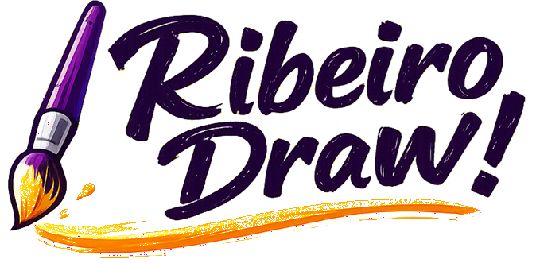

<p align="center">
  
</p>
<p align="center"><strong>Whiteboard colaborativo para diagramas de arquitetura cloud — abre e salva arquivos do draw.io.</strong></p>

Fork independente do [Excalidraw](https://github.com/excalidraw/excalidraw), otimizado para diagramas de infraestrutura cloud: **991 ícones** (810 oficiais AWS + 181 de marcas, linguagens, segurança, redes e formas) e **interoperabilidade completa com o draw.io** — importa e exporta `.drawio`/`.xml` com fidelidade. Totalmente self-hosted, sem dependências de serviços externos.

---

## Recursos

### Ícones (991 no total)

- **810 ícones oficiais AWS** inline (Architecture Service, Resource, Group e Category) — pacote oficial de julho/2026, carregamento instantâneo, zero requests de rede
- **Pack Tech com 181 ícones extras** — marcas, SaaS, CRMs/ERPs, linguagens de programação (Rust, Go, Java, C/C++/C#, PHP, Kotlin, Swift...), infra e cibersegurança (Cisco, Fortinet, Palo Alto, CrowdStrike, pfSense, Ubiquiti, MikroTik, Zabbix, Debian, Ubuntu...) e **Claude Code** (GitHub, Vercel, Kiro, TOTVS, Microsiga Protheus, Salesforce, HubSpot, Dynamics 365, SAP, Teams, WhatsApp, Meta, Facebook, Instagram, TikTok, Kwai, Netflix, Windows Server, Active Directory...), logos de cloud (Google Cloud, Azure, Oracle), ícones de redes de computadores (roteador, firewall, servidores, access point...) e figuras geométricas comuns (hexágono, estrela, nuvem, cilindro, balão de fala...) — carregado sob demanda, sem pesar o bundle inicial
- **Painel lateral** com busca em tempo real (AWS + Tech juntos), filtros por categoria e tabs por tipo de ícone; glifos pretos aparecem invertidos no painel escuro e entram no quadro na cor original
- **Inserção via clique ou drag-and-drop** com nome do serviço exibido automaticamente como texto editável
- **Grid virtualizado** — renderiza apenas os ícones visíveis na viewport para máxima performance

### Interoperabilidade com draw.io e IAs

- **Importa `.drawio` e `.xml`** — abra (`Ctrl+O`), arraste ou **cole o XML direto no canvas**; funciona com arquivos do app draw.io (inclusive comprimidos) e com os gerados por IAs (ChatGPT, Claude, Gemini...), reparando até XML malformado
- **Importação fiel ao original** — ícones AWS re-mapeados para os oficiais do acervo, setas encostando na borda das formas com rotas ortogonais, conexões que continuam editáveis (seguem os elementos ao arrastar), textos e títulos na posição exata, rótulos de conexão com fundo branco, mesma tipografia
- **Exporta `.drawio` e `.xml`** — o arquivo abre direto no draw.io, com formas, textos, conexões e ícones embutidos; ida e volta sem perdas (comprovado por testes com arquivos reais)
- **Cole Mermaid direto no canvas** — flowcharts gerados por IA viram elementos editáveis
- **"Aplicar estilo hand-drawn" com 1 clique** (paleta `Ctrl + /`) — o diagrama importado troca para o visual esboçado da casa (traço à mão + fonte manuscrita), no quadro todo ou só na seleção; `Ctrl + Z` desfaz

### Plataforma

- **100% independente** — nenhum dado enviado a terceiros (sem Sentry, Firebase, Google Fonts, Analytics)
- **Local-first** — salva automaticamente no browser (localStorage + IndexedDB)
- **Idioma padrão: Português Brasileiro** (100% traduzido) com suporte a 30+ idiomas
- **PWA** — funciona offline após primeiro acesso
- **Colaboração em tempo real** — via WebSocket (opcional, requer servidor próprio)
- **Exportação de imagem** — PNG, SVG, clipboard e arquivo `.excalidraw`
- **Canvas infinito** com zoom, pan, dark mode e estilo hand-drawn
- **Deploy na Vercel** — build estático otimizado

---

## Stack

| Camada   | Tecnologia                              |
| -------- | --------------------------------------- |
| Frontend | React 19, TypeScript 5.9                |
| Build    | Vite 5, esbuild                         |
| Monorepo | Yarn Workspaces                         |
| Estilo   | SCSS Modules                            |
| State    | Jotai                                   |
| Canvas   | HTML5 Canvas (roughjs)                  |
| Deploy   | Vercel (static)                         |
| Ícones   | SVG data-URIs inline (gerados no build) |

---

## Estrutura do Projeto

```
ribeiro-draw/
├── excalidraw-app/          # App web principal (Ribeiro Draw!)
│   ├── components/          # Componentes customizados (AwsIconPanel, etc.)
│   ├── data/                # awsIcons.ts (manifest gerado com 810 ícones inline)
│   ├── collab/              # Módulo de colaboração WebSocket
│   └── index.html           # Entry point
├── packages/
│   ├── excalidraw/          # Core library (canvas, tools, UI)
│   │   └── data/mxgraph*.ts # Importador e exportador draw.io/mxGraph
│   ├── common/              # Constantes e utilitários compartilhados
│   ├── element/             # Tipos e lógica de elementos
│   ├── math/                # Geometria e cálculos
│   └── utils/               # Utilitários de exportação
├── public/
│   └── icons/               # 810 SVGs AWS (4 conjuntos) + Tech-Icons (131)
├── scripts/
│   ├── generate-aws-manifest.mjs   # Manifest AWS com data-URIs inline
│   └── generate-tech-manifest.mjs  # Manifest do Pack Tech (chunk sob demanda)
├── .env.production          # Config de produção (tudo local, zero terceiros)
├── vercel.json              # Configuração de deploy Vercel
└── package.json             # Monorepo root
```

---

## Conjuntos de Ícones AWS

| Conjunto | Quantidade | Descrição |
| --- | --- | --- |
| Architecture Service | 305 | Serviços AWS (EC2, S3, Lambda, etc.) |
| Resource | 466 | Recursos específicos (instâncias, buckets, etc.) |
| Category | 26 | Ícones de categoria (Compute, Database, etc.) |
| Architecture Group | 13 | Agrupadores (VPC, Region, Subnet, etc.) |
| **Total** | **810** |  |

Fonte: [AWS Architecture Icons](https://aws.amazon.com/architecture/icons/) — versão Julho 2026.

## Pack Tech (tab "Tech" do painel)

| Conjunto | Quantidade | Exemplos |
| --- | --- | --- |
| Marcas & SaaS | 110 | GitHub, Vercel, Kiro, TOTVS, Microsiga Protheus, HubSpot, Dynamics 365, Zoho, Odoo, Sage, SAP HANA/S4HANA, Salesforce, Streamlit, Turso, Teams, WhatsApp, Meta, Instagram, TikTok, Kwai, Netflix, Windows Server, Active Directory, Kubernetes, Docker, Zendesk, Slack (colorido), Stripe, OpenAI, Anthropic, Rust, Go, Java, C/C++/C#, PHP, Ruby, Kotlin, Swift, Flutter, Angular, Laravel, Spring, Claude Code, Cisco, Fortinet, Palo Alto Networks, CrowdStrike, pfSense, Ubiquiti, MikroTik, Zabbix, Apache, Debian, Ubuntu, ServiceNow, Workday, Pipedrive, Lightspeed, RD Station... |
| Cloud | 4 | Google Cloud, Microsoft Azure, Oracle, Microsoft 365 |
| Redes | 41 | Roteador, Firewall, Servidor, Access Point, LAN, VPN, NAS, CCTV... |
| Formas | 26 | Hexágono, Triângulo, Estrela, Nuvem, Cilindro (BD), Balão de Fala, Documento, Cadeado, Engrenagem... |
| **Total** | **181** | carregado sob demanda (chunk separado) |

Fontes: [Simple Icons](https://simpleicons.org/) (CC0) e [Wikimedia Commons](https://commons.wikimedia.org/) (wordmarks) para marcas — os logos pertencem aos respectivos donos e são usados nominativamente; [Material Design Icons / Pictogrammers](https://pictogrammers.com/library/mdi/) (Apache 2.0) para redes. Gerado por `scripts/generate-tech-manifest.mjs` a partir de `public/icons/Tech-Icons/`.

---

## Desenvolvimento Local

### Pré-requisitos

- Node.js >= 18
- Yarn 1.x

### Instalação

```bash
git clone https://github.com/aryribeiro/ribeiro-draw.git
cd ribeiro-draw
yarn install
```

### Gerar manifest de ícones

```bash
node scripts/generate-aws-manifest.mjs
```

Isso escaneia `public/icons/`, converte cada SVG em data-URI inline e gera `excalidraw-app/data/awsIcons.ts` (~2.6 MB raw, ~450 KB gzip).

### Iniciar servidor de desenvolvimento

```bash
yarn start
```

Abre em `http://localhost:3001`

### Build de produção

```bash
yarn build
```

Output em `excalidraw-app/build/`

---

## Deploy na Vercel

O projeto está configurado para deploy direto na Vercel:

```json
{
  "outputDirectory": "excalidraw-app/build",
  "installCommand": "yarn install"
}
```

Basta conectar o repositório GitHub na Vercel. Não é necessário configurar variáveis de ambiente — tudo já está no `.env.production`.

---

## Guia Rápido de Uso

### Inserir ícones

1. O painel lateral abre automaticamente ao iniciar
2. Use a **busca** para encontrar um serviço ou marca (ex.: "Lambda", "S3", "GitHub", "Roteador")
3. Navegue pelas **tabs**: Serviços, Recursos, Grupos, Categorias e **Tech** (marcas, cloud e redes)
4. Filtre por **categoria** usando os chips (Analytics, Compute, Database...)
5. **Clique** no ícone para inserir no centro da tela, ou **arraste** para posicionar onde quiser
6. O nome do serviço aparece automaticamente como texto editável abaixo do ícone

### Navegar no canvas

- **Mover a tela**: segure `Scroll Wheel` ou `Espaço` + arrastar, ou use a ferramenta Mão
- **Zoom**: `Ctrl + Scroll` ou os botões -/+ no canto inferior esquerdo
- **Selecionar**: clique no elemento ou arraste uma área de seleção

### Ferramentas principais

| Atalho | Ferramenta            |
| ------ | --------------------- |
| `1`    | Seleção               |
| `2`    | Retângulo             |
| `3`    | Losango               |
| `4`    | Círculo               |
| `5`    | Seta                  |
| `6`    | Linha                 |
| `7`    | Lápis (desenho livre) |
| `8`    | Texto                 |
| `9`    | Imagem                |
| `0`    | Borracha              |

### Editar elementos

- **Mover**: arraste o elemento selecionado
- **Redimensionar**: arraste os handles nos cantos/bordas
- **Rotacionar**: arraste o handle circular acima do elemento
- **Editar texto**: clique duplo no texto
- **Duplicar**: `Ctrl + D`
- **Deletar**: `Delete` ou `Backspace`
- **Copiar estilo**: `Ctrl + Alt + C` / **Colar estilo**: `Ctrl + Alt + V`

### Organização

- **Agrupar**: selecione múltiplos elementos + `Ctrl + G`
- **Desagrupar**: `Ctrl + Shift + G`
- **Trazer para frente**: `Ctrl + ]`
- **Enviar para trás**: `Ctrl + [`
- **Alinhar**: selecione elementos e use o menu de alinhamento

### Salvar e exportar

- **Salva automaticamente** no browser (localStorage)
- **Exportar como imagem**: `Ctrl + Shift + E` (PNG ou SVG)
- **Salvar arquivo**: `Ctrl + S` (formato `.excalidraw`)
- **Abrir arquivo**: `Ctrl + O` (`.excalidraw`, `.drawio`, `.xml`, `.png`/`.svg` com cena)
- **Salvar como .drawio ou .xml**: menu Exportar — o arquivo abre direto no draw.io
- **Copiar para clipboard**: `Ctrl + Shift + C` (como PNG)

### Trabalhar com arquivos do draw.io e de IAs

1. **Abrir**: `Ctrl + O` e escolha um `.drawio` ou `.xml` — ou simplesmente arraste o arquivo para o canvas
2. **Colar**: copie o XML que uma IA gerou (ChatGPT, Claude, Gemini...) e cole direto no canvas (`Ctrl + V`)
3. Os ícones AWS chegam re-mapeados para os oficiais, as conexões continuam editáveis e os textos ficam onde o original os colocou
4. **Salvar de volta**: menu Exportar → "Salvar .drawio" ou "Salvar .xml" — ida e volta sem perdas

### Dicas

- Segure `Shift` ao desenhar para manter proporções
- Segure `Alt` ao redimensionar para escalar do centro
- Use `Ctrl + Z` / `Ctrl + Y` para desfazer/refazer
- Troque o tema (claro/escuro) no menu hamburger
- O idioma pode ser alterado no menu hamburger > seletor de idioma

---

## Autor

**Ary Ribeiro**

- GitHub: [@aryribeiro](https://github.com/aryribeiro)
- Email: [aryribeiro@gmail.com](mailto:aryribeiro@gmail.com)
- LinkedIn: [linkedin.com/in/aryribeiro](https://www.linkedin.com/in/aryribeiro)

---

## Licença

MIT — veja [LICENSE](./LICENSE)

Baseado no [Excalidraw](https://github.com/excalidraw/excalidraw) (MIT License).
